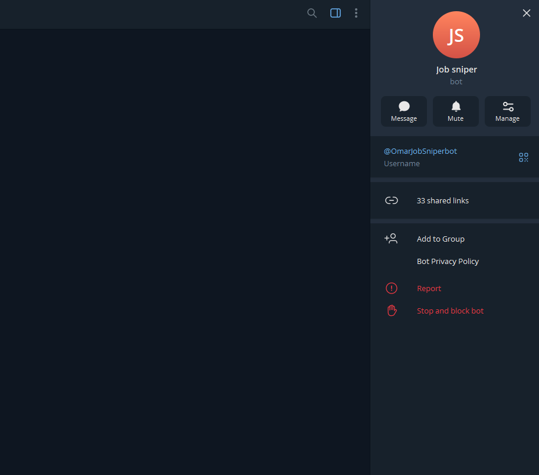
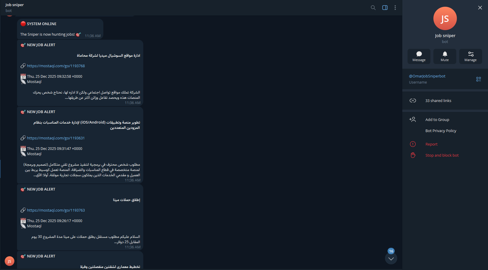

# 🎯 The Sniper - Automated Job Hunter Bot

Professional Python bot that monitors Mostaql RSS feed and sends instant Telegram notifications for new freelance projects.

## 🚀 Features

- Real-time job monitoring (every 10 minutes)
- Instant Telegram notifications in Arabic
- SQLite database to prevent duplicate alerts
- Smart first-run spam protection
- Runs silently in background
- Auto-start with Windows

## 🛠️ Tech Stack

- Python 3.x
- Libraries: requests, feedparser, sqlite3
- Telegram Bot API
- SQLite Database

## 📦 Installation

```bash
pip install requests feedparser
⚙️ Configuration
Edit run.py:

python
response-action-icon
TELEGRAM_TOKEN = "your_bot_token"
TELEGRAM_CHAT_ID = "your_chat_id"
RSS_FEEDS = ["https://mostaql.com/rss"]
🚀 Usage
Start: Double-click start_sniper.bat
Stop: Double-click stop_sniper.bat
Check Status: Double-click check_sniper.bat

📊 How It Works
Checks Mostaql RSS feed every 10 minutes
Compares jobs against SQLite database
Sends Telegram alert for new jobs only
Logs all activity to sniper.log
🎯 Impact
Gives me a competitive edge by notifying me within 10 minutes of new projects being posted, allowing me to bid first and land more freelance gigs.

## 📸 Screenshots

### Telegram Alerts


### Telegram Profile


### Bot Running Status


### Project Structure


Built by Omar Sayed